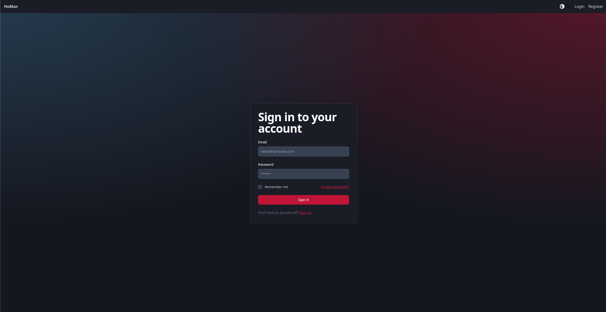
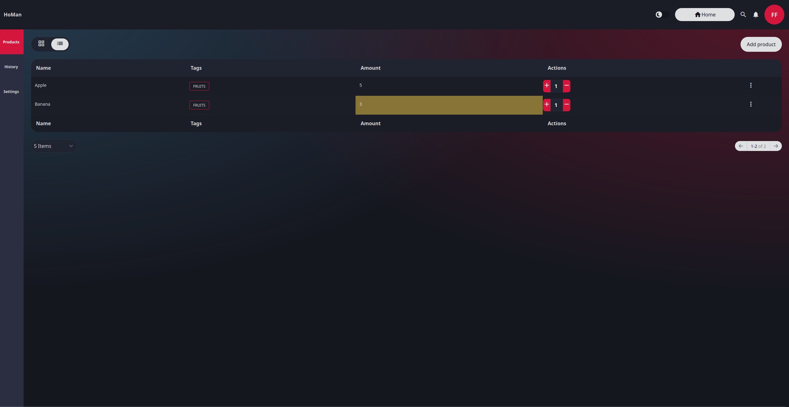

# HoMan

## Description

HoMan is a simple warehouse management system. It allows you to create warehouses, add products to them and manage them. It also allows you to create an account and log in to it. The application is written in Typescript and uses the Sveltekit framework on the frontend and Express.js on the backend. The database used is MongoDB. The application is deployed using docker and docker-compose.

## Technologies

- Backend:

  - Express.js
  - Openapi-bakcend
  - Typescript
  - Prisma
  - Zod

- Frontend:

  - Sveltekit
  - TailwindCSS
  - Typescript
  - Skeleton ui
  - Superforms
  - Zod
  - Floating ui

- Database:

  - MongoDB

- Deployment:
  - Docker
  - Docker-compose

## Start

```bash
docker-compose up
```

## Photos

Login page


Register page


Profile page


Warehouse list page


Warehouse products page



Add product form


Warehouse history page


Warehouse settings page

